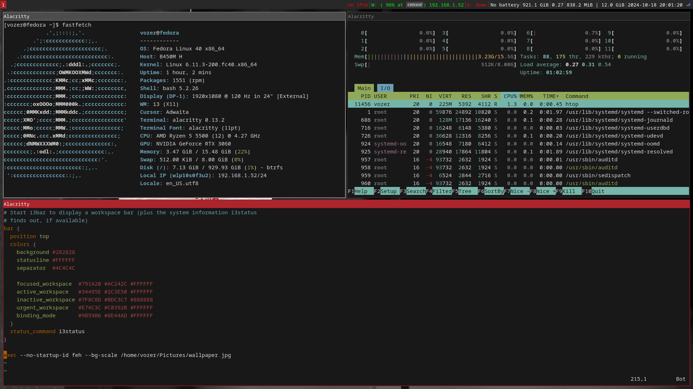

# Valentin's i3 config

Just a basic config that I use. The only dependencies are feh, flameshot  and alacritty. The recommended wallpaper is **wallpaper.jpg** (Yes, that's one of the default ElementaryOS wallpapers). To take a screenshot press Mod+Shift+Print, that will take a screenshot of your entire screen and paste it to the Pictures directory. Remember to remove the # and change directory at the end of the config file for feh to work.



### To Install feh flameshot and alacritty

#### On Debian-based distros (Ubuntu, etc.):
```
sudo apt install feh flameshot alacritty
```

#### On Fedora:
```
sudo dnf install feh flameshot alacritty
```

#### On Arch Linux:
```
sudo pacman -S feh flameshot alacritty
```

#### On OpenSUSE:
```
sudo zypper install feh flameshot alacritty
```

#### On Gentoo:
```
sudo emerge feh flameshot alacritty
```

If you have any questions (or recommendations) mail me at **valentin.ozer@proton.me**.
