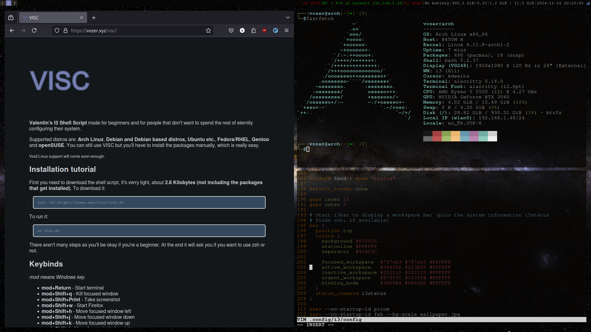

# VISC


**Valentin's I3 Shell Script** made for beginners and for people who don't want to spend the rest of eternity configuring their system.

### Full tutorial at vozer.xyz/visc

## Installation tutorial

First, download the shell script (only about **2.6 KB**). To download it:

```bash
curl https://vozer.xyz/visc/visc.sh
```

To run it:

```bash
./visc.sh
```




If you have any questions (or recommendations) mail me at **valentin.ozer@aol.com**.
