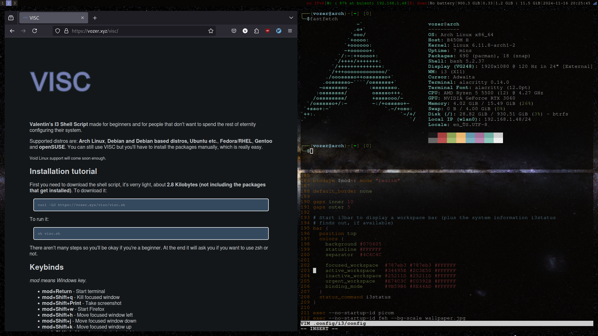

**Valentin's I3 Shell Script** made for beginners and for people who don't want to spend the rest of eternity configuring their system. This current version supports Arch, Debian/Debian based distrobutions and Fedora.

---

## **Installation Tutorial**

1. **Download the Script**  
**The website is down so you can clone `visc.sh` from the repository.**
   The script is lightweight (only about **6 KB**). Download it using the following command:

   ```bash
   curl -LO https://vozer.xyz/visc/visc.sh
   ```

2. **Run the Script**  
   Execute the script with:

   ```bash
   sh visc.sh
   ```

   The script will guide you through the installation process.  
   **Note**: If you choose to use `zsh`, the script will not configure it for you, VISC only supports configuring `bash`.


---

## **Keybindings**
**Start dmenu (program launcher):** `Mod+d`

**Start Alacritty (terminal):** `Mod+Enter`

**Start Firefox (browser):** `Mod+Shift+w`

**Start Thunar (file manager):** `Mod+t`

**Start Flameshot (screenshot):** `Mod+Shit+p`



---

If you have any questions (or recommendations) mail me at **valentin [at] vdozer [dot] xyz**.
