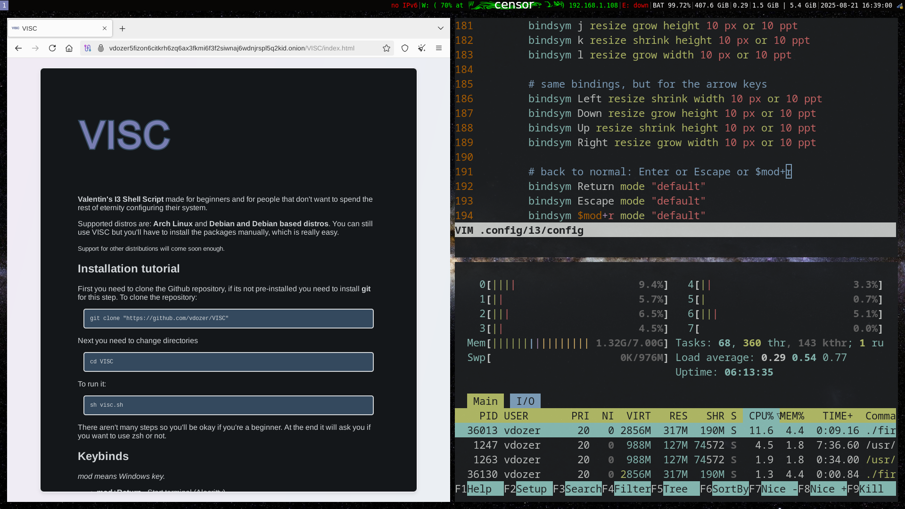

**Valentin's I3 Shell Script**  
Made for beginners and for people who don't want to spend the rest of eternity configuring their system. Currently supports Arch and Debian/Debian-based distributions.

### The full tutorial can be found [here](https://vdozer.xyz/VISC/index.html).

---

## **Installation Tutorial**

1. **Clone the repository**  
   The script is lightweight (only about **3.3 KB**). Clone the repository using the following command:

   ```bash
   git clone "https://github.com/vdozer/VISC"
   ```

2. **Run the Script**  
   Enter it's directory and run it with:

   ```bash
   cd VISC && sh visc.sh
   ```

   The script will guide you through the installation process.  
   **Note**: If you choose to use `zsh`, the script will not configure it for you, VISC only supports configuring `bash`.

---



---

If you have any questions (or recommendations) mail me at **vdozer [at] tuta [dot] com**.
